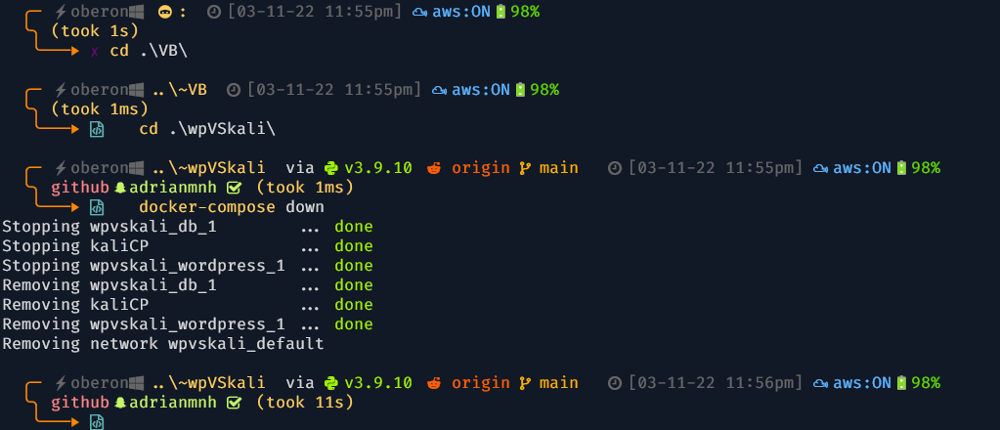

# Update

Running kali on VM.

# Installing Kali Linux using Docker container

After cloning github repo

Once the installation was completed, I tested to see if the environment was ready to be used

Finally, we terminate kali linux instance until next use

